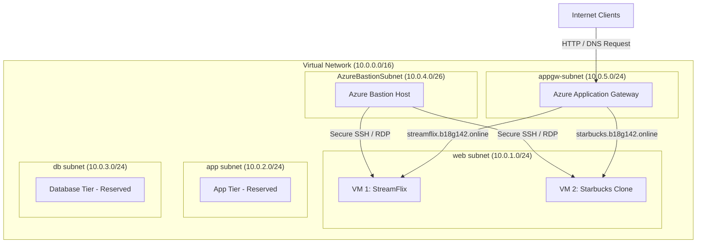

# Azure Multi-Tier Infrastructure with Application Gateway & Bastion

This Terraform project provisions a secure, multi-tier Azure infrastructure consisting of a Virtual Network (VNet), Virtual Machines (VMs) serving web applications, an Azure Bastion Host for secure administration, and an Azure Application Gateway acting as a Layer-7 load balancer routing traffic based on hostnames.

## 🏗️ Architecture Overview

The infrastructure deployed by this repository implements the following architecture:



### Key Components

1. **Resource Group**: Logical container for all the deployed Azure resources.
2. **Virtual Network & Subnets**:
   - `web`: For hosting web servers/virtual machines (`10.0.1.0/24`).
   - `app`: Reserved for future application-tier resources (`10.0.2.0/24`).
   - `db`: Reserved for future database-tier resources (`10.0.3.0/24`).
   - `AzureBastionSubnet`: Dedicated subnet for the Azure Bastion Host (`10.0.4.0/26`).
   - `appgw-subnet`: Dedicated subnet for the Azure Application Gateway (`10.0.5.0/24`).
3. **Compute (VMs)**:
   - Provisions Ubuntu 20.04 LTS VMs inside the `web` subnet.
   - Bootstrapped with `cloud-init` configurations to deploy Nginx and automatically clone static web applications from GitHub.
4. **Application Gateway**:
   - Set up as a `Standard_v2` gateway with standard public IP.
   - Configured with multi-site listeners for routing traffic:
     - `streamflix.b18g142.online` routes to `VM1` (StreamFlix site).
     - `starbucks.b18g142.online` routes to `VM2` (Starbucks clone site).
5. **Azure Bastion**:
   - Provides secure and seamless RDP/SSH access to the virtual machines directly in the Azure portal over SSL, eliminating the need to expose VMs to public IP addresses or maintain jump boxes.

---

## 📁 Repository Structure

```plaintext
rg-vnet-vm-appgw/
├── main.tf                 # Main entry point calling the modules
├── provider.tf             # Terraform providers configuration (AzureRM)
├── variable.tf             # Main variable declarations
├── terraform.tfvars        # Default variables values
├── output.tf               # Main root outputs definition
├── starbucks.yml           # Cloud-init config for the Starbucks VM web server
├── streamflix.yml          # Cloud-init config for the Streamflix VM web server
└── modules/
    ├── resource_group/     # Module to create the Resource Group
    ├── network/            # Module to provision VNet, subnets, and NSG
    ├── compute/            # Module to provision NICs and VMs
    ├── appgw/              # Module to deploy Application Gateway & Public IP
    └── bastion/            # Module to provision Azure Bastion & Public IP
```

---

## ⚙️ Configuration & Variables

### Input Variables (`terraform.tfvars`)

The main root configuration variables are:

* `rg_name`: Name of the resource group (e.g., `"resource1"`).
* `location`: The Azure region to deploy resource (e.g., `"Central India"`).
* `subnets`: Map defining the network address space for subnets.
* `vm_names`: List of VMs to deploy (default: `["vm1", "vm2"]`).
* `backend_ips`: Static allocation mappings for application gateway backends.

### Web Server Bootstrapping

The VMs utilize `cloud-init` to boot. Each VM has a YAML configuration defining Nginx installation and git cloning.

* **VM1 (StreamFlix)**: Bootstrapped via [streamflix.yml](streamflix.yml). Clones [StreamFlix](https://github.com/devopsinsiders/StreamFlix.git) template.
* **VM2 (Starbucks)**: Bootstrapped via [starbucks.yml](starbucks.yml). Clones [starbucks-clone](https://github.com/devopsinsiders/starbucks-clone.git) template.

---

## 🚀 How to Deploy

### 1. Prerequisites
Ensure you have the following installed:
* [Terraform](https://developer.hashicorp.com/terraform/downloads) (v1.0.0+)
* [Azure CLI](https://learn.microsoft.com/en-us/cli/azure/install-azure-cli)

### 2. Login to Azure
Authenticate with the Azure CLI:
```bash
az login
```

### 3. Initialize Terraform
Run `terraform init` to download the required AzureRM providers and initialize the project:
```bash
terraform init
```

### 4. Planning Phase
Verify the resources that Terraform will create:
```bash
terraform plan
```

### 5. Apply Changes
Apply the configurations to deploy the architecture to Azure. Review the plan and type `yes` to confirm:
```bash
terraform apply
```

### 6. Verify Deployed Sites
To access the sites, map the `appgw_public_ip` (output from Terraform) to the hostnames in your local `/etc/hosts` (Mac/Linux) or `C:\Windows\System32\drivers\etc\hosts` (Windows) file:
```text
<appgw_public_ip> streamflix.b18g142.online
<appgw_public_ip> starbucks.b18g142.online
```
Then navigate to:
* `http://streamflix.b18g142.online`
* `http://starbucks.b18g142.online`

---

## 📤 Outputs

After a successful deployment, Terraform outputs essential configuration values:

| Output | Description |
|---|---|
| `rg_name` | Name of the Resource Group created |
| `rg_location` | Deployed Azure Region |
| `vnet_name` | Name of the Virtual Network |
| `subnet_names` | List of Subnets and their configurations |
| `nic_private_ips` | Private IPs assigned to the VMs |
| `appgw_public_ip` | Public IP of the Application Gateway |

---

## 🛑 Clean Up

To destroy the infrastructure and stop charges:
```bash
terraform destroy
```
Type `yes` when prompted to confirm removal.
